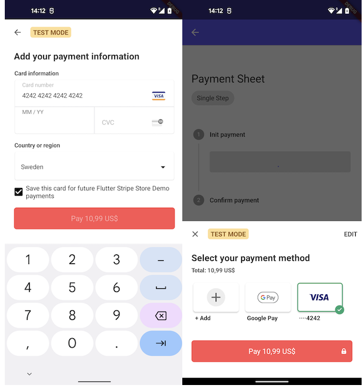

# Troubleshooting

## The plugin is crashing with a PlatformException on Android, on iOS it is working fine

Unfortunately configuring Android is a bit more work and if you do not match the following requirements. You can run into some issues.


#### Android 5.0 (API level 21) and above
You need to make sure the minSdk in the build.gradle is specifified to 21 or above.

```groovy
defaultConfig {
        applicationId "com.your.application"
        minSdkVersion 21
        targetSdkVersion 31
```

#### Kotlin version must be 1.5.0 

Our plugin consists of Kotlin code and if you run an outdated version of Kotlin  make sure you upgrade the version in your application's build.gradle file:

```groovy
buildscript {
    ext.kotlin_version = '1.5.0'
    repositories {
        google()
        jcenter()
    }

    dependencies {
        classpath "org.jetbrains.kotlin:kotlin-gradle-plugin:$kotlin_version"
    }
}
```

#### Gradle tools must be up to date

Out of date Gradle dependencies can yield to weird build results and the App not to compile. Check that you are using the same version (or higher) as specifified in the example app. 
- [Android tools](https://github.com/flutter-stripe/flutter_stripe/blob/main/example/android/build.gradle#L9) 
- [Gradle version](https://github.com/flutter-stripe/flutter_stripe/blob/main/example/android/gradle/wrapper/gradle-wrapper.properties#L6) 

#### Use FlutterFragmentActivity instead of `FluterActivity` as MainActivity

The Stripe sdk requires a `FlutterFragmentActivity` instead of the `FlutterActivity` that is standard specifified when creating a new Flutter project. Follow the following steps to change it:

1. Create a MainActivity kotlin file in the `Android` folder of your Flutter app. See the snippet below and our[example app](https://github.com/flutter-stripe/flutter_stripe/blob/79b201a2e9b827196d6a97bb41e1d0e526632a5a/example/android/app/src/main/kotlin/com/flutter/stripe/example/MainActivity.kt#L6).

```kotlin
package com.flutter.stripe.example

import io.flutter.embedding.android.FlutterActivity
import io.flutter.embedding.android.FlutterFragmentActivity

class MainActivity: FlutterFragmentActivity() {
}
```

2. Refer to the newly created activity in the AndroidManifest.

```xml
<application
        android:label="example"
        android:icon="@mipmap/ic_launcher">
        <activity
            android:name=".MainActivity"
            android:launchMode="singleTop"
```

#### Using a descendant of `Theme.AppCompat` for your activity.

In order to properly style the components you need to create a theme for the MainActivity that is a descendant of `Theme.AppCompat` or `Theme.MaterialComponents`. 

```xml
<?xml version="1.0" encoding="utf-8"?>
<resources>
    <!-- Theme applied to the Android Window while the process is starting when the OS's Dark Mode setting is off -->
    <style name="LaunchTheme" parent="Theme.AppCompat.Light.NoActionBar">
        <!-- Show a splash screen on the activity. Automatically removed when
             Flutter draws its first frame -->
        <item name="android:windowBackground">@drawable/launch_background</item>
    </style>
    <!-- Theme applied to the Android Window as soon as the process has started.
         This theme determines the color of the Android Window while your
         Flutter UI initializes, as well as behind your Flutter UI while its
         running.
         
         This Theme is only used starting with V2 of Flutter's Android embedding. -->
    <style name="NormalTheme" parent="Theme.MaterialComponents">
        <item name="android:windowBackground">?android:colorBackground</item>
    </style>
</resources>
```

See also our [example theme](https://github.com/flutter-stripe/flutter_stripe/blob/main/example/android/app/src/main/res/values/styles.xml#L15), [example night theme](https://github.com/flutter-stripe/flutter_stripe/blob/main/example/android/app/src/main/res/values-night/styles.xml#L16).


## The payment sheet doesn't open in production but it works on test.

Normally when you start developing your Stripe integration you are using test keys on both your Server and Client. When it is time to go to production you need to replace these keys with production ones. Learn more about Stripe api keys [here](https://stripe.com/docs/keys). If both client and server are using keys from different environments the payment intent cannot be handled by the client. That is why the payment sheet will not open.
In order to solve this issue make sure the following is in sync:

#### Server-side

- Publishable key needs to be a production key
- Secret key needs to be a production key

You can check if your backend is communicating with the live environment at the [Stripe dashboard](https://dashboard.stripe.com). Go to payments -> select a payment and check if `liveMode` is set to `true`.

```json
{
  "id": "pi_1234345",
  "object": "payment_intent",
  "last_payment_error": null,
  "livemode": true,
  "next_action": null,
  "status": "succeeded",
  ...
```

#### Client side

- Make sure that on the client the production publishable key is provided. 

```dart
Stripe.publishableKey = stripeProductionPublishableKey;
await Stripe.instance.applySettings();
```

- On initializing the payment sheet make sure that `isTestEnv` is set to `false`.

```dart 
await Stripe.instance.initPaymentSheet(
        paymentSheetParameters: SetupPaymentSheetParameters(
          ...
          testEnv: false,
          ...
        ),
      );
```


## The stored cards are not being displayed on the payment_sheet

On the payment sheet it is possible for the customer to save a card so it can be re-used again without the need for entering the card details again. For an elaborate description about this flow check the [stripe docs](https://stripe.com/docs/payments/save-during-payment).



When the customer marked save card for further use and it is not shown next time, make sure to check the following:

#### Server-side
The payment intent should be linked to a customer and for the customer an ephemeralKey should be created. You can check if this is the case for your integration by opening the: [Stripe dashboard](https://dashboard.stripe.com), go to payments-> select the payment and make sure it is linked to a customer.


```json

  "id": "pi_12345",
  "object": "payment_intent",
  ....
  "charges": {
    "object": "list",
    "data": [
      {
        "id": "ch_1234",
        "customer": "cus_12345",
```

#### Client-side
- When you communicate with your backend you should make sure that you receive both the customerId + ephemeralKey from the backend. If this is not the case checkout the [stripe docs][server implementation](https://stripe.com/docs/payments/save-during-payment?platform=react-native&ui=payment-sheet#react-native-add-server-endpoint) on creating a customer + key. 
- Provide the customer and ephemeralKey to the `SetupPaymentSheetParameters` when initializing the PaymentSheet. 

```dart
 await Stripe.instance.initPaymentSheet(
        paymentSheetParameters: SetupPaymentSheetParameters(
          // Main params
          paymentIntentClientSecret: data['paymentIntent'],
          merchantDisplayName: 'Flutter Stripe Store Demo',
          // Customer params
          customerId: data['customer'],
          customerEphemeralKeySecret: data['ephemeralKey'],
          // Extra params
```

